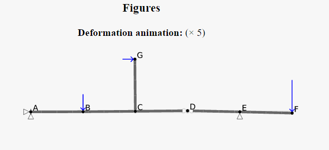

[](https://travis-ci.org/jlblancoc/openbeam)

# openbeam
A C++ library for static analysis of mechanical structures: a definition language, parser, static solver and SVG renderer.



Features:
 - TODO!


License: GNU GPL v3. Contact the author if a commercial license is required.

## Documentation
 - TODO!

## Compile instructions
Ubuntu: Install prerequisites with:

```
sudo apt-get install build-essential cmake libqt5-dev qt5-qmake libqt5svg5-dev
```

Windows: Just use CMake as usual. Required: Visual C++ 2008 or newer.


## Compile web app:

Install emsdk.

```bash
cmake -DCMAKE_TOOLCHAIN_PATH=path/to/Emscripten.cmake ..
make
```

Test locally: `python3 -m http.server 8000`
