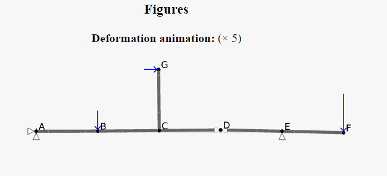

[](https://travis-ci.org/open-beam/openbeam)

# openbeam
A C++ library for static analysis of mechanical structures: a definition language, parser, static solver and SVG renderer.



Features:
 - TODO!


License: GNU GPL v3. Contact the author if a commercial license is required.

## Documentation
 - https://open-beam.github.io/openbeam/
 - Structure definition (YAML) format: https://open-beam.github.io/openbeam/structure-definition-format.html

## Citation
If you use OpenBeam in your work, please cite:

> J.L. Blanco-Claraco, J. López-Martínez, F.J. Garrido-Jiménez, P. Gómez-Calvache, J.M. García-Manrique-Ocaña.
> OpenBeam: Off-Line and On-Line Tools to Solve Static Analysis of Mechanical Structures.
> Proceedings of the XV Ibero-American Congress of Mechanical Engineering (IACME 2022), pp. 57-63. Springer, 2023.
> https://doi.org/10.1007/978-3-031-38563-6_9

```bibtex
@inproceedings{blanco2023openbeam,
  title     = {{OpenBeam}: Off-Line and On-Line Tools to Solve Static Analysis of Mechanical Structures},
  author    = {Blanco-Claraco, Jos{\'e} Luis and L{\'o}pez-Mart{\'i}nez, Javier and Garrido-Jim{\'e}nez, Francisco Javier and G{\'o}mez-Calvache, Pedro and Garc{\'i}a-Manrique-Oca{\~n}a, Jos{\'e} Manuel},
  booktitle = {Proceedings of the XV Ibero-American Congress of Mechanical Engineering},
  pages     = {57--63},
  year      = {2023},
  publisher = {Springer},
  doi       = {10.1007/978-3-031-38563-6_9}
}
```

## Compile instructions
Ubuntu: Install prerequisites with:

```
sudo apt-get install build-essential cmake libqt5-dev qt5-qmake libqt5svg5-dev
```

Windows: Just use CMake as usual. Required: Visual C++ 2008 or newer.


## Compile web app:

Install emsdk.

```bash
cmake -DCMAKE_TOOLCHAIN_PATH=path/to/Emscripten.cmake ..
make
```

Test locally: `python3 -m http.server 8000`
