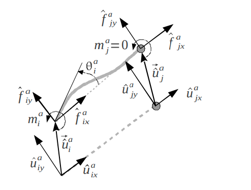
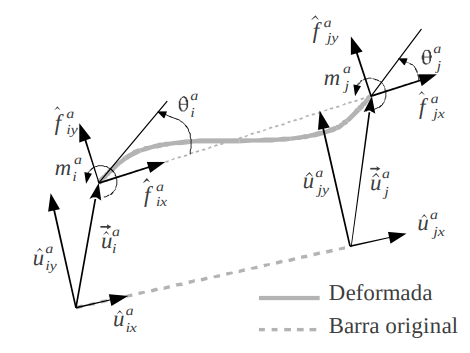
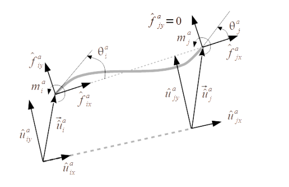
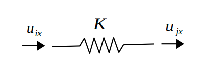
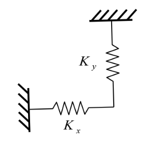
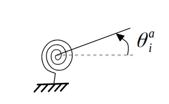
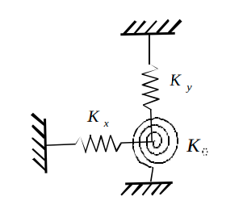

.. _finite_elements:

Implemented finite elements
=================================

Type names are the strings that must be used in the `elements`
section of a YAML definition file (see :ref:`yaml_definition`).

Parameters for each element may be defined on a per-element basis,
or by means of a `beam_sections` YAML entry to reuse sets of 
parameters for several elements.
Note that defining more parameters than the minimum required ones
is not an error, 
e.g. you can define ``Iz`` for a ``BEAM2D_AA`` and it
will neither be used nor an error triggered.

1. Rod 2D element (truss)
-------------------------------------------------

.. image:: imgs/element_BEAM2D_AA.png
  :width: 347
  :align: right
  :alt: 2D rod finite element definition

A planar (XY) rod element capable of axial stress only.

* Type name: ``BEAM2D_AA``
* Number of nodes: 2
* Required parameters:

  * ``E``: Young elasticity module.
  * ``A``: Section area.

.. raw:: html

    

.. dropdown:: Local-coordinates stiffness matrices

    .. math::
      :nowrap:

      \begin{equation*}
      \hat{\mathbf{K}}_{ii} = \hat{\mathbf{K}}_{jj} =
      \begin{blockarray}{ccccccc}
      x & y & z & r_x & r_y & r_z \\
      \begin{block}{(cccccc)c}
        EA/L & 0 & 0 & 0 & 0 & 0 & x \\
        0 & 0 & 0 & 0 & 0 & 0 &  y \\
        0 & 0 & 0 & 0 & 0 & 0 &  z \\
        0 & 0 & 0 & 0 & 0 & 0 &  r_x \\
        0 & 0 & 0 & 0 & 0 & 0 &  r_y \\
        0 & 0 & 0 & 0 & 0 & 0 &  r_z \\
      \end{block}
      \end{blockarray}
      \end{equation*}

      \begin{equation*}
      \hat{\mathbf{K}}_{ij} = 
      \begin{blockarray}{ccccccc}
      x & y & z & r_x & r_y & r_z \\
      \begin{block}{(cccccc)c}
        -EA/L & 0 & 0 & 0 & 0 & 0 & x \\
        0 & 0 & 0 & 0 & 0 & 0 &  y \\
        0 & 0 & 0 & 0 & 0 & 0 &  z \\
        0 & 0 & 0 & 0 & 0 & 0 &  r_x \\
        0 & 0 & 0 & 0 & 0 & 0 &  r_y \\
        0 & 0 & 0 & 0 & 0 & 0 &  r_z \\
      \end{block}
      \end{blockarray}
      \end{equation*}

1. Single-pinned 2D element (beam)
-------------------------------------------------

A planar (XY) beam element with one pinned end (**no** bending moment)
and one rigid end (**with** bending moment).
Two names exist for this element for convenience of users,
depending on which which node (the first or the second listed node)
is the pinned one.

* Type name: ``BEAM2D_AR`` (first node is pinned), ``BEAM2D_RA`` (second node is pinned)
* Number of nodes: 2
* Required parameters:

  * ``E``: Young elasticity module.
  * ``A``: Section area.
  * ``Iz``: Second moment of inertia in the `Z` axis.

.. raw:: html

    

3. 2D beam element
-------------------------------------------------

A planar (XY) beam element with both ends able to 
transmit bending moment.

* Type name: ``BEAM2D_RR``
* Number of nodes: 2
* Required parameters:

  * ``E``: Young elasticity module.
  * ``A``: Section area.
  * ``Iz``: Second moment of inertia in the `Z` axis.

.. raw:: html

    

4. 2D beam element with slider
-------------------------------------------------

A planar (XY) beam element with both ends able to 
transmit bending moment, and second node free 
to slide on the local Y axis.

* Type name: ``BEAM2D_RD``
* Number of nodes: 2
* Required parameters:

  * ``E``: Young elasticity module.
  * ``A``: Section area.
  * ``Iz``: Second moment of inertia in the `Z` axis.

.. raw:: html

    

5. Linear spring
-------------------------------------------------

A spring element in the local X direction between two given nodes.

* Type name: ``SPRING_1D``
* Number of nodes: 2
* Required parameters:

  * ``K``: Stiffness constant.

.. raw:: html

    

6. Two linear springs
-------------------------------------------------

A spring element with two elastic components in the local X and Y
directions between two given nodes. The picture shows one node being the ground
but it can be any other problem node too.

* Type name: ``SPRING_XY``
* Number of nodes: 2
* Required parameters:

  * ``Kx``: Stiffness constant in X.
  * ``Ky``: Stiffness constant in Y.

.. raw:: html

    

7. Torsion spring
-------------------------------------------------

A torsion spring element in the rotation Z axis between two given nodes.

* Type name: ``SPRING_TORSION``
* Number of nodes: 2
* Required parameters:

  * ``K``: Torsional stiffness constant in Z.

.. raw:: html

    

8. All 2D degrees-of-freedom spring
-------------------------------------------------

Two linear and one torsion spring element between two given nodes.

* Type name: ``SPRING_DXDYRZ``
* Number of nodes: 2
* Required parameters:

  * ``Kx``: Torsional stiffness constant in x.
  * ``Ky``: Torsional stiffness constant in y.
  * ``KRz``: Torsional stiffness constant in rotation around z.

.. raw:: html

    

